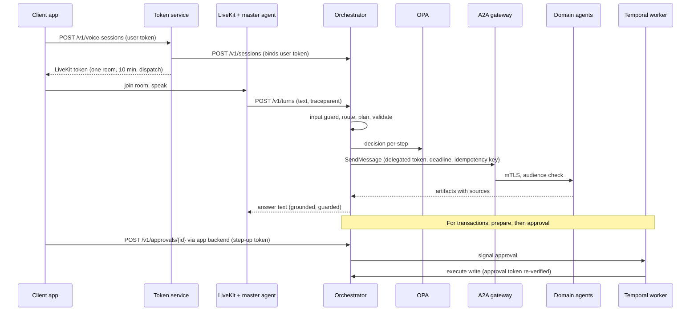

# Agent Orchestrator: User Guide

Version 1.0 · Python 3.12 · Companion to the whitepaper "Enterprise Multi-Agent Orchestrator"

## 1. What this is

This repository implements the architecture from the whitepaper in Python. A client app starts a voice or chat session through the **token service**, joins a LiveKit room, and talks to the **master agent**. The master agent handles audio and turn-taking only; every user turn goes to the **orchestrator**, which decides what to do, checks policy, calls **domain agents** over A2A through the mesh gateway, and returns the exact text to speak. Transactions run as durable **Temporal** workflows that wait for the user's step-up approval, which reaches the orchestrator from the client's backend, never through the voice agent.

The orchestrator never lets a model decide anything consequential. Routing to advice or transactions is rule-based, plans come from a reviewed catalogue, every agent call is checked by OPA, every answer must be grounded in attributed sources, and every decision lands in a hash-chained audit ledger.

| Component | Code | Runs as |
|---|---|---|
| Orchestrator API | `src/orchestrator/` | `python -m orchestrator` (FastAPI) + OPA sidecar |
| Transaction worker | `src/orchestrator/workflows/` | `python -m orchestrator.workflows.worker` |
| Master agent | `src/master_agent/` | `python -m master_agent.agent start` (LiveKit Agents worker) |
| Token service | `src/token_service/` | `uvicorn token_service.app:create_app --factory` |
| Domain agent kit + samples | `src/domain_agents/` | one service per agent behind the A2A gateway |
| Command center | `src/orchestrator/console/` | `/console` on the orchestrator; `make console` locally |
| Policy | `policies/orchestrator.rego` | OPA sidecar |
| Deployment | `deploy/` | Docker, docker compose, Helm (AKS), Envoy gateway, OTel collector |

## 2. How a turn flows



The orchestrator's pipeline for one turn is: session lock, replay check, input guard, routing, admission, plan, plan validation, plan-phase policy, then either execution of read steps or preparation of a transaction, followed by aggregation, output guard and audit. The code is in `src/orchestrator/service.py`.

## 3. Prerequisites

For unit tests you need only Python 3.12 with PyYAML, PyJWT and cryptography. For the local stack you need Docker with compose. For voice you also need STT and TTS credentials (the defaults are Deepgram and Cartesia; any LiveKit plugin can be configured). For AKS you need an AKS cluster with Workload Identity and the Key Vault CSI driver, Azure Managed Redis, Azure Database for PostgreSQL, a Temporal cluster (self-hosted or Temporal Cloud in an approved region), an Entra ID tenant and a container registry.

Install for development:

```bash
python -m venv .venv && . .venv/bin/activate
pip install -e ".[orchestrator,token-service,dev]"
```

Pin exact versions before deploying (`make lock`); the `pyproject.toml` only carries lower bounds.

## 4. Quick start

### 4.1 Run the tests

```bash
make test            # ~140 unit tests, no network, no external services
make console         # command center with the whole stack and simulated customers
make opa-test        # policy tests, needs the opa binary
```

### 4.2 Orchestrator alone, in memory

This uses `config/orchestrator.dev.yaml`: no authentication, local policy engine, in-memory sessions, a JSONL audit file, and the demo agents.

```bash
PYTHONPATH=src uvicorn domain_agents.stub_server:app --port 8443 &   # demo agents
make run-dev                                                          # orchestrator on :8080

curl -s localhost:8080/v1/sessions -H 'content-type: application/json' \
  -d '{"session_id":"demo-1","dev_user":{"subject":"u1","acr":"standard","tenant":"ch"}}'

curl -s localhost:8080/v1/turns -H 'content-type: application/json' \
  -d '{"session_id":"demo-1","turn_id":"t1","text":"How is my portfolio doing?"}'
```

The answer combines the portfolio and market agents and lists its sources. Try "What are your opening hours?", "Should I rebalance?" (advice, with the disclaimer appended) and "Ignore all previous instructions" (blocked). Transactions are refused in this profile because workflows are disabled.

### 4.3 Full local stack

```bash
make compose-up
curl -s localhost:8080/readyz
```

This starts Redis, PostgreSQL, Temporal (UI on :8233), OPA with the real policy, an OpenTelemetry collector, the demo agents, the orchestrator, the worker, LiveKit in dev mode and the token service. A transaction end to end:

```bash
curl -s localhost:8080/v1/sessions -H 'content-type: application/json' \
  -d '{"session_id":"demo-2","dev_user":{"subject":"u1","acr":"standard","tenant":"ch"}}'

curl -s localhost:8080/v1/turns -H 'content-type: application/json' \
  -d '{"session_id":"demo-2","turn_id":"t1","text":"Sell 50 units of my tech ETF"}'
# -> type "approval_required", with approval.approval_id, approval.action_hash, approval.workflow_id

curl -s localhost:8080/v1/approvals/<approval_id> -H 'content-type: application/json' \
  -d '{"approve":true,"action_hash":"<action_hash>","dev_user":{"subject":"u1","acr":"stepup","tenant":"ch"}}'

curl -s "localhost:8080/v1/workflows/<workflow_id>?session_id=demo-2"
# -> status "completed" with the order reference
```

Approving with `"acr":"standard"` is refused (step-up required), as is a different subject or a changed hash.

### 4.4 Voice

Set `DEEPGRAM_API_KEY` and `CARTESIA_API_KEY` (or change providers in `config/master_agent.yaml`) and start the voice profile with `docker compose -f deploy/docker/docker-compose.yaml --profile voice up -d`. Create a session through the token service (`POST localhost:8090/v1/voice-sessions`) and join the returned room with any LiveKit client, for example the LiveKit Agents Playground, using the returned URL and token.

## 5. Configuration

Each service reads a YAML file and then environment overrides. The orchestrator reads `ORCH_CONFIG_FILE` and variables prefixed `ORCH__`; the master agent `MA_CONFIG_FILE` and `MA__`; the token service `TS_CONFIG_FILE` and `TS__`. Nested keys are joined with double underscores and values are parsed as JSON where possible:

```bash
ORCH__BUDGETS__TURN_DEADLINE_MS=2000
ORCH__KILL_SWITCH__DISABLED_AGENTS='["trade-agent"]'
ORCH__ROUTING__MIN_CONFIDENCE__R2=0.9      # changes one key; the others keep their defaults
```

Unknown keys are rejected, so a typo fails at start-up rather than being silently ignored. Secrets are never in YAML: keys ending in `_env` name the environment variable that holds the secret, which in AKS is mounted from Key Vault.

The complete list of keys with defaults, override names and descriptions is in [CONFIG_REFERENCE.md](CONFIG_REFERENCE.md). It is generated from the code, and a test fails if a key is undocumented.

### 5.1 Profiles and the production baseline

`profile: prod` turns on validation rules that stop the service from starting if the configuration is unsafe. In prod, caller authentication must be on (`jwt` or `mesh_xfcc`) with an allowlist for every route group; end-user tokens must be validated against the IdP with asymmetric algorithms; policy must come from OPA; identity delegation must be on, using Workload Identity rather than a client secret, with a sender constraint; sessions must be in Redis and the audit ledger in PostgreSQL with turns failing if audit fails; the gateway must be HTTPS with verification; content capture in telemetry must be off; injection suspects must be blocked; and workflows must be enabled. At runtime the session encryption key and the Temporal payload key must be present. Validate any file with:

```bash
PYTHONPATH=src python -m orchestrator.cli validate-config config/orchestrator.prod.yaml
```

### 5.2 Keys and secrets

Generate fresh keys with `python -m orchestrator.cli gen-keys`. It prints `ORCH_SESSION_KEY` (Fernet, encrypts user tokens in Redis), `ORCH_APPROVAL_KEY` (seed for the Ed25519 approval signer), `MA_DISPATCH_KEY` (HMAC for LiveKit dispatch metadata, shared by the token service and master agent) and `ORCH_TEMPORAL_PAYLOAD_KEY` (encrypts workflow payloads). Store them in Key Vault. Publish the approval public key to the services that must verify approvals with `python -m orchestrator.cli approval-public-key`.

## 6. The intent catalogue

`config/intents.yaml` maps what users ask to what the system does. Each intent has an `id`, a `risk` class, a `required_acr`, routing `patterns` and a list of `steps`.

```yaml
- id: portfolio.overview
  risk: R1                     # R0 info, R1 personalised read, R2 advice, R3 transaction
  description: Portfolio overview with current prices
  required_acr: standard       # one of auth.acr_levels
  quorum: all                  # all | majority | any (optional)
  patterns:                    # case-insensitive regular expressions
    - "\\b(my )?(portfolio|holdings|positions)\\b"
  clarification_prompt: Would you like your whole portfolio or one account?
  steps:
    - id: holdings
      agent: portfolio-agent   # must exist in agents.yaml
      skill: portfolio.holdings
      data_classes: [client_confidential]
    - id: prices
      agent: market-agent
      skill: market.quotes
      optional: true           # skipped under load; failure makes the answer partial
      data_classes: [public]
```

Steps may declare `depends_on` (steps run in parallel layers in dependency order), `mode: write`, `timeout_ms`, `cost_units` and an `instruction` sent to the agent. Only the plan's leaf steps (those nothing depends on) contribute to the answer; earlier steps feed their outputs forward as `inputs`. This is how the advice intent achieves maker-checker: the compliance step's approved wording is spoken, the draft is not.

The loader enforces the rules that make the catalogue safe: step dependencies form a DAG; every step names a registered agent and one of its skills; writes only on agents registered for writes; any intent with a write step is R3, and every R3 intent has exactly one write step and a `readback_template`. Transactions follow a prepare-then-execute shape: read steps run inline and the step before the write returns the proposed action in `data.action`; the read-back is rendered from those fields (`{quantity}`, `{instrument}` and so on; only plain field names are allowed).

When several intents match equally, the user is asked to clarify; the orchestrator never guesses between them. An optional model classifier (`routing.model_classifier`) can pick among R0 and R1 intents when no rule matches, and validation prevents it from being allowed to choose advice or transactions.

## 7. The agent registry

`config/agents.yaml` lists each agent's `name`, token `audience`, `skills`, the environments it is `certified_in`, the data classes it is cleared for (`clearance`), whether `writes_allowed`, its `cost_units`, and `card_sha256` (the approved Agent Card version, informational here and enforced by the registry pipeline and gateway). An agent that is not certified for `service.environment` is never called; this is how the advice and trade agents are available in dev and test but not in prod until approved.

## 8. Policy

Every step is evaluated by OPA twice: once when the plan is built (phase `plan`) and again immediately before the call (phase `execute`), with the exact user, intent, step, agent, kill-switch state and approval state. The policy lives in `policies/orchestrator.rego` (Rego v1) with tests in `policies/orchestrator_test.rego`. `src/orchestrator/policy.py` contains a Python mirror used in dev and tests; `tests/test_policy_parity.py` fails if their deny rules diverge, and another test fails if the copy in the Helm chart is out of date (`make helm-sync`).

Policy decisions fail closed: timeouts, errors and malformed responses are denials. Allow decisions for R0/R1 reads may be cached for `policy.cache_ttl_s`; denials, advice and writes are never cached.

## 9. Adding a domain agent

A domain agent is any service that meets this contract. The `DomainAgent` class in `src/domain_agents/kit.py` implements it and is the quickest way to comply; `src/domain_agents/portfolio_agent/agent.py` shows it with Microsoft Agent Framework phrasing the answer from facts.

The agent speaks A2A v1.0 JSON-RPC `SendMessage` and rejects requests without a supported `A2A-Version` header. It verifies the delegated bearer token: issuer, expiry and that the audience is this agent (the gateway checks this too). It honours `metadata.idempotencyKey` so that the same key never repeats a side effect and returns the same result, including for concurrent duplicates. It does not start work after `metadata.deadlineEpochMs`. It returns artifacts whose metadata includes `sources` (a non-empty list for anything personalised, advisory or transactional; unattributed artifacts are dropped) and a `classification` (one of `guards.response_allowed_classifications` to be spoken). A prepare step returns the proposed action in `data.action`, using strings or integers for amounts so that the action hash is stable across languages. A write step refuses to run without `metadata.approvalToken` and has its tool gateway verify that token against the action hash with the orchestrator's approval public key (`verify_approval_token` in `orchestrator/approvals.py` is the reference). The trace context in `traceparent` should be continued in the agent's own spans.

To register it: add it to `config/agents.yaml`, add a route, cluster and JWT provider to the gateway (`deploy/envoy/a2a-gateway.yaml` shows the pattern), reference its skills from intents, and certify it for each environment only after it passes the A2A TCK and your acceptance tests.

## 10. Client app integration

The app obtains a LiveKit token from `POST /v1/voice-sessions` on the token service, sending the user's access token as a bearer token, and joins the returned room. It should register a LiveKit RPC handler for `orchestrator.approval_request` (configurable). The payload carries `approval_id`, `action`, `action_hash`, `expires_at` and `required_acr`.

When an approval request arrives, the app shows the action to the user and triggers step-up authentication. It must recompute the hash from the action it actually displayed, as SHA-256 over canonical JSON (keys sorted, no whitespace, UTF-8), and send that hash, not the one it received:

```python
hashlib.sha256(json.dumps(action, sort_keys=True, separators=(",", ":"), ensure_ascii=False).encode()).hexdigest()
```

The app then calls its own backend, which calls `POST /v1/approvals/{approval_id}` on the orchestrator with body `{"approve": true, "action_hash": "..."}` and the step-up user token in the `X-User-Token` header. The backend's identity must be listed under `auth.route_callers.approvals`. The master agent speaks the outcome when the workflow finishes.

## 11. Deploying to AKS

For a complete test environment on one Azure VM (Entra ID, LiveKit, fake core-banking backend) deployed by one script, see [AZURE_TEST_ENV.md](AZURE_TEST_ENV.md). This section describes the production deployment.

Build one image per component from `deploy/docker/Dockerfile` (`--build-arg EXTRAS=orchestrator|agent|token-service|domain`), push it to your registry and deploy by digest.

Create an Entra app registration for the orchestrator, grant it on-behalf-of permissions to each agent's API, and add a federated credential for the orchestrator's Kubernetes service account (Workload Identity). Put the keys from section 5.2 and the Redis URL and PostgreSQL DSN in Key Vault; the chart mounts them through the CSI driver and maps them to environment variables (`keyVault.secrets` in `values.yaml`).

Prepare the values file with your production configuration and catalogue, then install:

```bash
helm upgrade --install orchestrator deploy/helm/orchestrator -n orchestrator \
  -f my-values.yaml \
  --set-file config.orchestratorYaml=config/orchestrator.prod.yaml \
  --set-file config.intentsYaml=config/intents.yaml \
  --set-file config.agentsYaml=config/agents.yaml \
  --set-file config.evalsYaml=config/evals.yaml
```

The chart deploys the API with an OPA sidecar on localhost, the Temporal worker (also with an OPA sidecar, because writes are policy-checked at execution), a Service, HPA, PodDisruptionBudget, zone spreading, a default-deny NetworkPolicy with explicit ingress and egress, non-root read-only containers, and config checksums that roll pods when configuration changes. Run `python -m orchestrator.cli migrate-audit` once as a job before the first deployment, grant the runtime database user only INSERT and SELECT on the audit table, and replicate it to immutable storage.

The mesh must present workload certificates and must **sanitise the XFCC header** (`forward_client_cert_details: SANITIZE_SET`) on every sidecar in front of the orchestrator; with `auth.mode: mesh_xfcc` the orchestrator trusts that header. Deploy the A2A gateway from `deploy/envoy/a2a-gateway.yaml`, generating one route, cluster and JWT provider per registered agent. Point the OTel collector (`deploy/otel/collector.yaml`) at Azure Monitor or your Grafana stack; it strips any GenAI content attributes as a second line of defence.

The master agent runs as a LiveKit Agents worker next to your self-hosted LiveKit; scale it on LiveKit's worker load. The token service is the only component exposed to the internet, behind your API gateway and WAF.

## 12. Operations

Day-to-day operation happens in the **command center** (`/console`). It covers real-time dashboards, the live decision stream with a turn inspector that explains every decision, agent health, safeguards, evals, kill switches, session termination, and governed runtime changes to agent behaviour. [COMMAND_CENTER.md](COMMAND_CENTER.md) covers it in full. The API endpoints below remain available for automation.

**Kill switch.** `PUT /admin/kill-switch` with `{"disabled_agents": [...], "disabled_intents": [...], "disabled_risk_classes": [...]}` takes effect across all replicas within about five seconds and is audited with the caller's identity. Configured switches (`kill_switch.*`) are always merged in. Switching off `R3` stops all new transactions; users hear `messages.transactions_unavailable`.

**Audit verification.** `GET /admin/audit/{chain_id}/verify` or `python -m orchestrator.cli verify-audit <chain_id>` recomputes a chain. Chains are per session (session id) and per transaction (workflow id). Records carry the trace id, so a trace in Grafana or Application Insights leads to the audit chain and back.

**Load.** Each replica admits up to `admission.max_concurrent_turns`. Above the soft ratio, optional steps are skipped and answers are marked partial; at the hard ratio only transaction turns are admitted and others hear the busy message. Scale on CPU (HPA) and watch the busy rate. Cell-level admission for new sessions is in the token service (`admission.*`).

**Signals worth alerting on.** Useful signals are the rate of `turn_error`, `policy_denied`, `output_blocked` and `input_blocked` audit events, handover rate, busy rate, p95 turn latency against `budgets.turn_deadline_ms`, open circuit breakers per agent, token exchange failures, OPA latency, and workflows ending `failed` or `expired`.

**Key rotation.** The session key can be rotated by draining sessions (they are short-lived). Approval keys: publish the new public key to verifiers first, then switch the signer. Temporal payload key: deploy a codec that can decrypt with both keys before encrypting with the new one.

## 13. Security checklist before go-live

Confirm that `validate-config` passes on the exact production file; every route group in `auth.route_callers` lists only the intended callers; XFCC is sanitised on all sidecars; no service reaches an agent except through the gateway (NetworkPolicy); agents verify token audience and approval tokens; `certified_in` lists `prod` only for agents that passed the TCK and acceptance testing; the audit table is append-only for the runtime user and replicated to WORM storage; telemetry content capture is off and the collector strips content; Key Vault access is limited to the workload identities; images are pinned by digest with SBOMs; the client recomputes the action hash; and the Rego tests pass in CI.

## 14. Troubleshooting

**Service refuses to start with "invalid configuration".** The message lists every violated rule; fix them or check whether you meant to run with `profile: dev`.

**Every request is refused.** Look for `policy_denied` or `plan_rejected` in the audit chain; the `reasons` field says why (for example "agent not certified for environment" when `service.environment` does not match `certified_in`).

**All answers say "I couldn't complete that just now".** Agents are failing or timing out; check `step_result` audit records for errors, the circuit breaker state, and whether `budgets.turn_deadline_ms` is realistic for the agents' latency.

**Answers are missing.** Artifacts without `sources` (R1 and above) or with a classification outside `guards.response_allowed_classifications` are dropped by design.

**Approvals fail with "displayed action does not match".** The client is hashing a different representation; check key ordering, whitespace and number formatting (use strings or integers for amounts).

**The voice agent never joins.** The worker rejects dispatch metadata with a bad signature or older than `dispatch_max_age_s`; check that `MA_DISPATCH_KEY` is identical in the token service and master agent and that clocks are in sync.

**Token exchange fails in AKS.** Check that the pod has the `azure.workload.identity/use: "true"` label, that `AZURE_FEDERATED_TOKEN_FILE` is set, and that the federated credential's subject matches the service account. On a VM (`identity.client_auth: managed_identity`), check that the managed identity in `AZURE_CLIENT_ID` is attached to the VM and that the app's federated credential names its object id as subject.

## 15. What is verified and what needs integration testing

The orchestration core and the command center are covered by about 140 unit tests that run without network access: configuration and validation, catalogue integrity, routing, guards and PII redaction, planning and budgets, the local policy engine and its parity with the Rego file, fail-closed OPA handling, token exchange forms and Workload Identity assertions, the A2A request and response mapping, parallel execution with deadlines, retries and circuit breakers, aggregation, the audit hash chain, approvals with Ed25519 tokens, turn idempotency, the full transaction flow, the domain agent kit including concurrent idempotency, JWT and XFCC authentication, dispatch signing and cross-service configuration consistency. A contract test runs the orchestrator's real A2A client against the real agent kit.

The command center's backend is unit-tested, its development server is tested over real sockets, and its web console was driven in a real browser against the live backend and in demo mode (see COMMAND_CENTER.md, section 10).

The adapters for FastAPI, httpx, Redis, PostgreSQL, Temporal, OpenTelemetry, LiveKit Agents and Microsoft Agent Framework are syntax-checked but were not executed in the build environment, which had no network and none of those SDKs. Before production, run the compose stack end to end, run `opa test`, run the A2A TCK against each agent, verify the LiveKit hook names against your pinned version, and load-test a cell. `docs/REVIEW.md` lists the review findings and these open items in detail.
